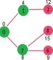

# Dijkstra 最短路径算法

给定一个图和图中的一个源点，找出从源到图中所有顶点的最短路径。

Dijkstra 算法跟[Prim 最小生成树算法](https://www.geeksforgeeks.org/prims-minimum-spanning-tree-mst-greedy-algo-5/)类似。像 Prim MST(minimun spanning tree)，我们会生成一个以给定一个源点为跟的最短路径树(SPT, shortest path tree)。我们主要维护两个集合，一个包含了最短路径树中包含的顶点，另一个集合是最短路径树中未包含的顶点。在这个算法的每一步，我们找到一个顶点，它是在另一个集合(指未包含的顶点集合)，距离源点有一个最小的距离（边）。

下面是 Dijkstra 算法用于寻找从一个源点到给定图中所有其他顶点的最短路径的详细步骤。

## 算法

1. 创建一个 sptSet 集合(最短路径树集合)，它表示跟踪最短路径树中包含的顶点，即计算并最终确定其与源点的最小距离。这个集合的初始状态是空的。
2. 新建一个图并给所有顶点给定一个距离值。初始化这个距离值为 INFINITE。为源点分配距离值 0，代表它首先被选中。
3. 当 sptSet 不包含任何顶点时
   1. 选择一个顶点 u，这个订单不在 sptSet 集合中并且有一个最小距离值
   2. 将 u 推送至 sptSet
   3. **更新 u 所有相邻顶点的距离值**（这一点很重要，不然与贪心算法无异了）。为了更新这个距离值，要确保遍历所有相邻的点。对于每个相邻的顶点 v，如果 u（从源到 u）的距离值与边 u-v 的权值（就是边值）小于 v 的距离值，则更新 v 的距离值（说明 v 的距离要比 u 到源点的短）。

看下面的例子帮助理解：


sptSet 集合初始是空的以及给它分配了给顶点的距离为 {0,INF, INF, INF, INF, INF, INF, INF}，其中 INF 表示无限。现在我们先选择一个距离值最小的顶点。即顶点 0，它被推入 sptSet 集合。所以此时 sptSet 就是 {0}。在添加至集合之后，就要更新与之相邻的所有顶点的距离值。也就是顶点 1 和顶点 7。其距离值分别为 4、8。下面的字图展示了顶点及距离边值，只显示了距离值有限的顶点。SPT 中包含的顶点以绿色显示。


从中选择最小边的顶点，并且这个顶点没有在 SPT 集合中（sptSet）。选择之后就将其顶点加入至 sptSet 集合。所以此时 sptSet 现在就变成了 {0,1}。并更新顶点 1 相邻的距离值。顶点 2 的距离值就变成了 12。


选择最小边的顶点，并且这个顶点没有在 SPT 集合中（sptSet）。那么顶点 7 就被选出来了。所以 sptSet 现在就变为了 {0,1,7}。然后更新顶点 7 相邻顶点的距离值。顶点 6 和顶点 8 的距离值由 INFINITE 变成有限的（分别是15和9）。



然后又重复上面的步骤，选出最小的边，直到 sptSet 包含所有的顶点。最后我们就得出了下面的最短路径树。


## 如何实现算法

我们使用一个布尔数组 sptSet[] 来表示 SPT 中包含的顶点集。如果值 sptSet[v] 为真，则表示顶点 v 包含在 SPT 中，否则不包含。Array dist[] 用于存储所有顶点的最短距离值。

```c#
class GFG {
		static int V = 9;
		// 帮助函数
		// 从最短路径树中尚未包含的一组顶点中，找出具有最小距离值的顶点
		int minDistance(int[] dist, bool[] sptSet) {
				// 初始化
        int min = int.MaxValue, min_index = -1;
        for (int v = 0; v < V; v++)
            if (sptSet[v] == false && dist[v] <= min) {
                min = dist[v];
                min_index = v;
            }
        return min_index;
		}
		// 帮助函数
		// 打印已经构造的距离数组
		void printSolution(int[] dist)
    {
        Console.Write("Vertex \t\t Distance "
                      + "from Source\n");
        for (int i = 0; i < V; i++)
            Console.Write(i + " \t\t " + dist[i] + "\n");
    }
    // dijkstra 最短路径算法
    // 一种用邻接矩阵表示的图
    void dijkstra(int[, ] graph, int src)
    {
        int[] dist = new int[V]; // 输出数组 dist[i]
        // 保持 src 到 i 的最短路径
        // 如果顶点 i 包含在从 src 到 i 的最短路径树或最短距离中
        // sptSet[i] = true
        bool[] sptSet = new bool[V];
 
 				// 初始化距离以及 stpSet
        for (int i = 0; i < V; i++) {
            dist[i] = int.MaxValue;
            sptSet[i] = false;
        }
 
 				// 顶点到它自己的距离是 0
        dist[src] = 0;
 
        // 在所有的顶点中找出最短路径
        for (int count = 0; count < V - 1; count++) {
        		// 从尚未处理的顶点集合中选择最小距离的顶点。
        		// 在第一迭代中 u 总是等于 src
            int u = minDistance(dist, sptSet);
            // 编辑这个顶点已经被处理，防止后面重复处理
            sptSet[u] = true;
 						
 						// 更新这个顶点相邻的所有顶点的 dist 值
            for (int v = 0; v < V; v++)
 
 								// 只有当 dist[v] 不在 sptSet 中时
 								// 有一条从 u 到 v 的边，并且 src 到 v 再到 u 的路径总权重小于 dist[v] 的当前值
 								// 就执行条件体
                if (!sptSet[v] && graph[u, v] != 0 && dist[u] != int.MaxValue && dist[u] + graph[u, v] < dist[v])
                    dist[v] = dist[u] + graph[u, v];
        }
 
        // 打印最短距离树数组
        printSolution(dist);
    }
  
  	public static void Main()
    {
        int[, ] graph = new int[, ] { { 0, 4, 0, 0, 0, 0, 0, 8, 0 },
                                      { 4, 0, 8, 0, 0, 0, 0, 11, 0 },
                                      { 0, 8, 0, 7, 0, 4, 0, 0, 2 },
                                      { 0, 0, 7, 0, 9, 14, 0, 0, 0 },
                                      { 0, 0, 0, 9, 0, 10, 0, 0, 0 },
                                      { 0, 0, 4, 14, 10, 0, 2, 0, 0 },
                                      { 0, 0, 0, 0, 0, 2, 0, 1, 6 },
                                      { 8, 11, 0, 0, 0, 0, 1, 0, 7 },
                                      { 0, 0, 2, 0, 0, 0, 6, 7, 0 } };
        GFG t = new GFG();
        t.dijkstra(graph, 0);
    }
}
```

注意：

1. 该代码计算最短距离，但不计算路径信息。我们可以创建一个父数组，当距离更新时更新父数组(就像 [prim 的实现](https://www.geeksforgeeks.org/prims-minimum-spanning-tree-mst-greedy-algo-5/))，并使用它显示从源到不同顶点的最短路径。
2. 该代码用于无向图，同样的 dijkstra 函数也可以用于有向图
3. 该代码查找从源到所有顶点的最短距离。如果我们只对从源到单个目标的最短距离感兴趣，我们可以在选定的最小距离顶点等于目标时中断 for 循环(步骤3.1 的算法)。
4. 实现的时间复杂度为O(V^2)。如果输入图是用[邻接表](https://www.geeksforgeeks.org/graph-and-its-representations/)表示的，那么在二叉堆的帮助下，它可以简化为O(E log V)。请参阅 [Dijkstra 算法的邻接表表示法](https://www.geeksforgeeks.org/greedy-algorithms-set-7-dijkstras-algorithm-for-adjacency-list-representation/)的更多细节。
5. Dijkstra 算法不适用于具有负权环的图，但对于具有负边的图，它可以给出正确的结果。对于具有负权边和环的图，可以使用[Bellman-Ford 算法](http://en.wikipedia.org/wiki/Bellman-Ford_algorithm)，我们将在另一篇文章中讨论它。

[邻接表表示的Dijkstra算法](https://www.geeksforgeeks.org/greedy-algorithms-set-7-dijkstras-algorithm-for-adjacency-list-representation/)

[Dijkstra 最短路径算法中的路径打印](https://www.geeksforgeeks.org/printing-paths-dijkstras-shortest-path-algorithm/)

[STL 中使用集合的 Dijkstra 最短路径算法](https://www.geeksforgeeks.org/dijkstras-shortest-path-algorithm-using-set-in-stl/)

## 原文链接

https://www.geeksforgeeks.org/dijkstras-shortest-path-algorithm-greedy-algo-7/