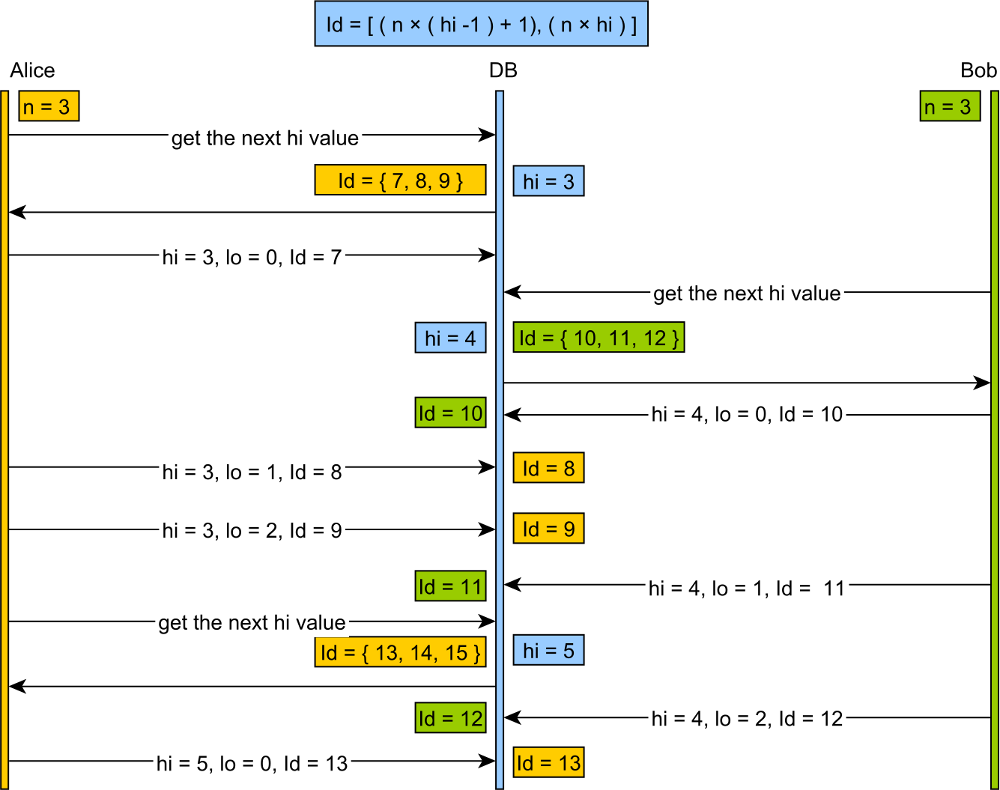

# HiLo 算法

## 介绍

在设计数据库模型的时候要特别注意数据库标识符策略。数据库序列是非常方便的，因为这在大多数例子中是都有拓展性和高效的。

但是由于序列被缓存，应用程序要求数据库每次交互都要生成一个新的序列值。如果你的应用程序对于每次事物大量的插入操作有高要求的，这里的序号分配就要用到 hi/lo 算法了。

## hi/io 算法

hi/lo 算法要分隔一些序列域到 "hi" 组。"hi" 值的分配是同步的。每个 "hi" 组都有最大数目的 "lo" 条目数，那样能被线下分配，并且不用担心并发重复的条目。

1. 数据库分配的 "hi" 令牌，而且两个并发调用都能保证看的是连续唯一的值。

2. 一旦一个 "hi" 令牌被检索，我只需要 "incrementSize"（"lo" 的条目数）

3. 标识符范围是按照下面计算公式分配：
   $$
   [(hi -1)*incrementSize)+1,(hi*incrementSize))
   $$

"lo" 值将会取自：
$$
[0，incrementSize]
$$
开始自
$$
[(hi-1)*incrementSize)+1)]
$$

4. 当所有的 "lo" 值都被用完时，就会获取新的 "hi" 值，然后继续下去。

这里给你一个两个并发事物的例子，每次事务插入多个条目：



## 测试理论

如果我有以下条目：

```java
@Entity
public class Hilo {
		@GeneratedValue(strategy = GanerationType.SEQUENCE, generator = "hilo_sequence_generator")
		@GenericGenerator(
			name = "hilo_sequence_generator",
			strategy = "org.hibernate.id.enhanced.SequenceStyleGenerator",
			parameters = {
					@Parameter(name = "sequence_name", value = "hilo_sequence"),
					@Parameter(name = "initial_value", value = "1"),
					@Parameter(name = "increment_size", value = "3"),
					@Parameter(name = "optimizer", value = "hilo")
			})
		@Id
		private Long id;
}
```

我们可以在插入多次条目的时候，检查数据库有多少次序列往返的问题：

```java
@Test
public void testHiloIdentifierGenerator() {
	doInTransaction(new TransactionCallable<Void>() {
			@Override
			public Void execute(Session session)
			{
					for(int i = 0; i < 8; i++)
					{
							Hilo hilo = new Hilo();
							session.persist(hilo);
					}
					session.flush();
			}
			return null;
	});
}
```

最后生成的以下 SQL 查询：

```sql
Query:{[call next value for hilo_sequence][]}
Query:{[insert into Hilo (id) values (?)][1]}
Query:{[insert into Hilo (id) values (?)][2]}
Query:{[insert into Hilo (id) values (?)][3]}
Query:{[call next value for hilo_sequence][]}
Query:{[insert into Hilo (id) values (?)][4]}
Query:{[insert into Hilo (id) values (?)][5]}
Query:{[insert into Hilo (id) values (?)][6]}
Query:{[call next value for hilo_seqeunce][]}
Query:{[insert into Hilo (id) values (?)][7]}
Query:{[insert into Hilo (id) values (?)][8]}
```

你可以看到 8 次条目插入只有三个序列被调用。在一个事务中插入越多的条目，我们要求获得的性能要越好，因为我们减少了数据库往返次数。

## 延伸阅读

Hilo 算法基本原理就是你有两个数字组成了一个主键 —— 一个 "high" 值和一个 "low" 值。客户端能增长 "high" 序列值，知道它能安全的从范围是上一个 "high" 值以及变化的 "low" 值的条目数生成密钥。

举个例子，假设你有一个 "high" 序列，并且当前值为 35，而 "low" 值在 0-1023 范围内。接着客户端能将序列增长到 36（对于其它客户端来说是可以生成的，正当 35 正在用的时候）并且知道密钥 35/0，35/1，35/2，35/3... 35/1023 都是可用的。

能够在客户端生成一组主键来说是非常用的（特别是 ORM），而不是通过增加没有主键的值以及把它们送回到客户端。另外一方面，这个意思就是你能很容易弄 父/子 关系，在你所有插入之前都有了这些值了，这样对批量操作更贱简单。

https://vladmihalcea.com/the-hilo-algorithm/

https://stackoverflow.com/questions/282099/whats-the-hi-lo-algorithm