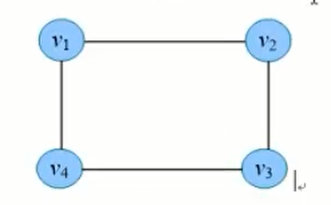
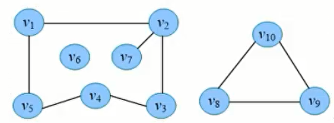
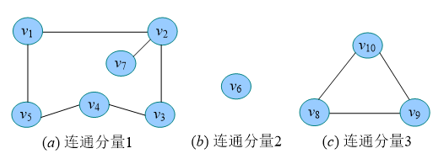

# Prim 算法和 Kruskal 算法

Prim 算法和 Kruskal 算法都是用于解决最小生成树（Minimum Spanning Tree）问题的经典算法，它们的本质区别在于构建最小生成树的策略和实现方式。

1. Prim 算法：

   - Prim 算法采用**顶点驱动**的策略，从一个起始顶点开始逐步扩展最小生成树，直到覆盖所有顶点。
   - 算法维护一个优先级队列（通常使用最小堆）来选择具有最小权重的横切边。它选择连接已包含在最小生成树中的顶点和未包含在最小生成树中的顶点之间的最小权重边。
   - Prim 算法保证每一步都选择当前最小权重的边，并将其添加到最小生成树中，直到形成完整的最小生成树。
   - Prim 算法适用于稠密图，即边的数量较多的图。

   ```java
   private void visit(EdgeWeightedGraph G, int v) {
       // 将顶点v添加到树中，更新数据
       marked[v] = true;
       for (Edge e : G.adj(v)) {
           int w = e.other(v);
           if (marked[w]) { // 如果w已经在树中，跳过
               continue;
           }
           if (e.weight() < distTo[w]) { // 如果e的权重更小，更新数据
               edgeTo[w] = e;
               distTo[w] = e.weight();
               if (pq.contains(w)) {
                   pq.change(w, distTo[w]);
               }
               else {
                   pq.insert(w, distTo[w]);
               }
           }
       }
   }
   ```

2. Kruskal 算法：

   - Kruskal 算法采用**边驱动**的策略，首先将所有边按照权重进行排序，然后逐个考虑边，将其加入最小生成树中，直到最小生成树包含了图中的所有顶点。
   - 算法使用并查集数据结构来判断边是否会形成环路，如果不会形成环路，则将该边加入最小生成树中。
   - Kruskal 算法不保证每一步都选择当前最小权重的边，而是选择不会形成环路的边，直到形成完整的最小生成树。
   - Kruskal 算法适用于稀疏图，即边的数量相对较少的图。

   ```java
   mst = new Queue<>();
   MinPQ<Edge> pq = new MinPQ<>();
   for (Edge edge : G.edges()) {
       pq.insert(edge);
   }
   UF uf = new UF(G.V());
   
   while (!pq.isEmpty() && mst.size() < G.V() - 1) {
       Edge e = pq.delMin(); // 从优先级队列中取出权重最小的横切边
       int v = e.either(), w = e.other(v);
       // 如果边的两个顶点不在同一个连通分量中，则加入最小生成树
       if (uf.find(v) == uf.find(w)) {
           continue; // 该横切边已经在最小生成树中，跳过
       }
       uf.union(v, w); // 合并分量
       mst.enqueue(e); // 将横切边加入最小生成树
   }
   ```

## 连通分量

连通图：无向图中，如果顶点 vi 到 vj 有路径，则称 vi 和 vj 是连通的，如果图中**任意两个顶点都是连通的**，则称 G 为连通图。



连通分量：无向图 G 的*极大连通子图*称为 G 的连通分量。极大连通子图的意思是：该子图是 G 的连通子图，如果再加入一个顶点，该子图不连通。下图中该图有三个连通分量。对于连通图，则其连通分量就是他自己，对于非连通图，则有 2 个以上的连通分量。





## 强连通图和强连通分量

强连通图：有向图中，如果图中**任意两个顶点 vi 到 vj 有路径，且 vj 到 vi 也有路径**，则称 G 为强连通图。

强连通分量：有向图 G 的*极大强连通子图*称为 G 的强连通分量。极大强连通子图意思是：该子图是 G 的强连通子图，如果再一个加入顶点，该子图不再是强连通的。例如下图中，(a)是强连通图，(b)不是强连通图，(c)是(b)的强连通分量。


弱连通或者单向连通就是指只有一个方向相连。