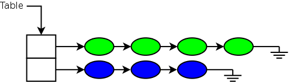
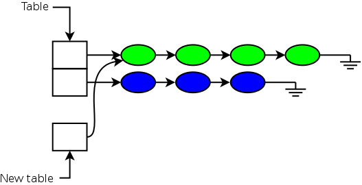
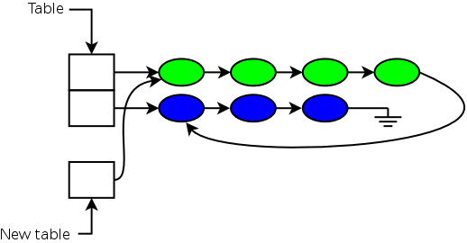
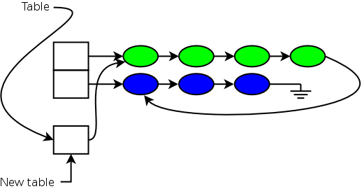
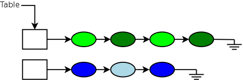
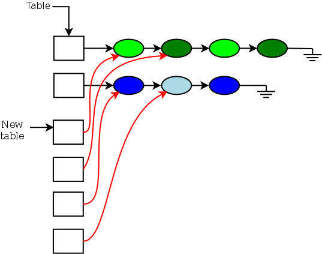
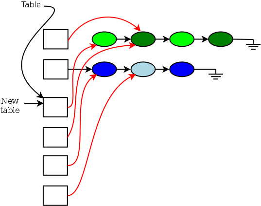
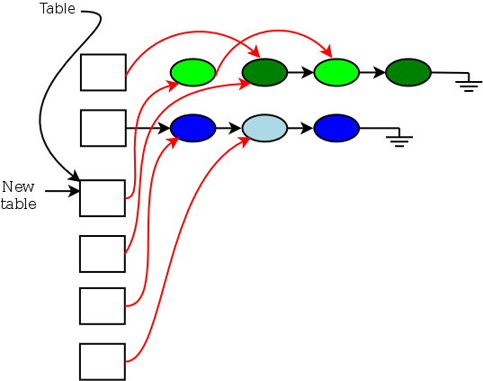
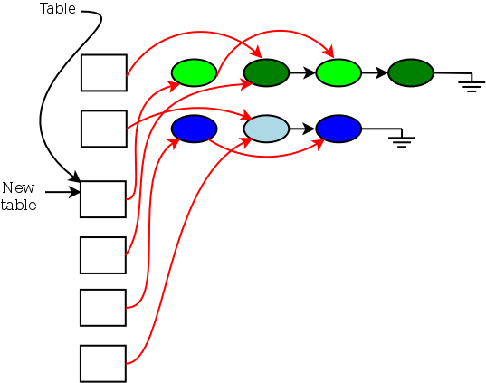

# 相对哈希表——算法部分

[哈希表](http://en.wikipedia.org/wiki/Hash_table)在内核中被广泛使用，以加快对感兴趣对象的访问速度。使用哈希表比通过单一列表进行线性搜索要快，但总是有价值让访问变得更快。多年来，为了这个目标已经做了很多工作；例如，使用读-复制-更新（RCU）可以允许在不阻止读取器的情况下向哈希桶列表添加和删除项目。然而，有些操作要实现并发性更加困难，其中表的调整大小几乎排在首位。截至 3.17 版本，Linux 内核通过一种可以在并发进行查找的同时进行调整大小的“相对论哈希表”的实现来解决了这个问题。本文将描述所使用的算法；一个[配套的文章](https://lwn.net/Articles/612100/)将查看这些新哈希表的内核 API。

人们可能会怀疑哈希表的调整大小是否足够常见，值得优化。事实证明，选择哈希表的正确大小并不容易；内核有许多表，其大小是在系统初始化时通过启发式和简单的猜测来确定的。但即使最初的猜测是完美的，工作负载也可能随时间变化。一个最初大小合适的表，在变化后可能会变得太小（因此性能不佳）或太大（浪费内存）。调整表的大小可以解决这些问题，但由于这样做很难而不阻止对表的访问，所以它往往不会发生。长期性能增益并不被视为值得因关闭对表的访问而进行调整时引起的短期延迟。

2010 年，Josh Triplett、Paul McKenney 和 Jonathan Walpole 发表了一篇名为[《通过相对编程实现可调整大小、可扩展的并发哈希表》](https://www.usenix.org/legacy/event/atc11/tech/final_files/Triplett.pdf)的论文，描述了这个问题的潜在解决方案。“相对（Relativistic）”是指两个事件（比如哈希表插入）的相对时间，如果它们没有因果关系，可能对独立观察者看起来不同。换句话说，一个 CPU 可能看到一个项目以一种顺序插入到表中，而在另一个 CPU 上，这些插入看起来却以相反的顺序发生。

尽管一些有趣的性能结果，这项技术直到 3.17 合并窗口打开时才进入内核，当时 Thomas Graf 贡献了一个实现，用于网络子系统中。大多数情况下，相对哈希表与普通哈希表相似。**它们被实现为一个桶数组和一个哈希函数，将对象分配到桶中。每个桶包含一个链表，链表上是所有属于该桶的表中项目**。一个简单的具有两个桶的表可能被描述为：

展示了一个有两个桶的哈希表，第一个桶有四个项目，第二个桶有三个项目。

## 表的缩减

现在想象这个巨大的哈希表被认为太大了；如果能将其缩减到一个桶就好了（不需要指出一个单桶哈希表是无用的；这里的目的是尽可能简化示例）。第一步是分配新表（不让它对其他人可见），并将每个桶链接到旧表中将在新表中哈希到该桶的第一个列表：

注意假设所有落入旧表中同一桶中的项目也将落入新表中的同一桶。这是算法工作的要求。在实践中，这意味着表的大小只能通过整数因子改变；通常这意味着表的大小只能加倍或减半。

无论如何，新表现在在其唯一的桶中有一些必要的项目（绿色的），但蓝色的项目仍然没有被表示。这可以通过简单地将它们接在绿色列表的末尾来修复：

在这一点上，遍历绿色列表的读取器可能会进入添加到末尾的蓝色项目。由于哈希查找无论如何都必须比较键，结果仍然是正确的，只是比以前要花更长的时间。但一旦操作完成，事情就会这样工作。完成操作只需要指向新表而不是旧表：

**任何在此之后出现的新的读取器都会看到新表，但可能还有并发的读取器在旧表的列表中遍历。因此，调整大小的实现必须等待一个 RCU 宽限期过去；在那之后，旧表可以被释放，操作就完成了。**

## 表的扩展

使表变大是一个有些不同的操作，因为在旧表中出现在单个哈希桶中的对象必须在新表的多个桶中分割。想象我们从同样的两个桶的表开始：

我们现在希望将该表扩展到四个桶。图中对象的颜色意味着一旦调整大小完成，每个对象将落在哪个桶中。第一步是分配新表，并为新表中的每个桶设置一个指针，指向包含属于该桶的所有对象的链：

请注意，新表哈希桶中的每个指针都指向旧链中将哈希到新桶的第一个项目。因此，尽管新表中每个哈希链包含不属于那里的对象，但列表中的第一个对象总是在正确的桶中。此时，就可以使用新表进行查找了，不过由于需要传递似乎在错误列表中的对象，查找速度会比需要的慢。

要使新表对读取器可见，必须相应地更改指向哈希表的指针。然后，扩展代码必须等待一个 **RCU 宽限期**过去，以便可以确定不再有任何查找运行在旧表上。然后，可以开始清理（“解压缩”）新表中的列表的过程。

该过程通过遍历旧表中的桶来工作，旧表尚未被释放。对于每个桶，算法大致如下：

1. 确定列表中第一个项目属于新表中的哪个桶。
2. 将列表头指针推进列表，直到遇到第一个不属于同一桶的项目。

处理完第一个桶后的结果看起来可能像这样：

然后，将不匹配的对象（以及紧随其后的任何类似对象）通过更改前一个项目的“下一个”指针从列表中修补出来：

此时，在另一个 RCU 宽限期过去之前，不能再对这个列表做任何更改，否则跟随这些列表的读取器可能会走到错误的地方。请记住，读取器可以与上述更改同时并发跟随这些列表，但它们将从新表中的指针开始。寻找浅绿色对象的读取器可能正在查看在第一步中从列表中修补出来的深绿色对象，但由于该对象的“下一个”指针保持不变，读取器不会被破坏。寻找深绿色对象的读取器从一开始就不会看到被更改的对象，所以它们也是安全的。

换句话说，该算法是通过改变指针来工作的，而这些指针只对那些不在寻找将从列表中 "解压缩 "的对象的读者可见。只要每个 RCU 宽限期只更改列表中的一个指针，这个属性就保持，并且可以在读取器穿过它的同时安全地解压缩列表。请注意，每个桶（来自旧表）都可以在每个周期中以这种方式处理，因此这个示例中的第二个桶也可以部分解压缩。因此，当在第一次通过旧表后等待宽限期发生时，数据结构看起来会像这样：

哈希列表现在已经部分理顺，但工作还没有完成。因此，解压缩过程再次运行，如果需要，在每个列表中调整另一个“下一个”指针。这个过程一直持续，直到到达每个哈希列表的末尾，此时每个对象只出现在其适当的桶中：

如果哈希列表很长，这个过程可能需要相当长的时间。但调整大小操作应该是相对罕见的，而读取器频繁地访问表。因此，对于一个足够以读取为主的表，最终额外的努力将是值得的；不常见的操作所做的额外工作将在热门（读取）路径上多次得到回报。

## 其它细节

上述描述到目前为止避免讨论的一个问题是表的更新。即使在没有“相对”技术的情况下，更新这样的哈希表也需要一定程度的互斥；例如，任何时候只有一个线程应该尝试更新任何给定哈希桶的头指针。一般来说，更新还必须以相同的方式与调整大小操作同步；对表进行更改的线程将不得不等待调整大小操作完成。

话虽如此，在进行调整大小时，可以采用一些技巧来加快这些操作的速度。对于缩减操作，一旦该桶的列表拼接完成，就可以允许更新访问每个哈希桶。扩展则更加复杂。一旦新表设置好，就可以并发地在列表头部进行插入，因为解压缩过程不会更改头部指针。但是，删除需要与调整大小器协调，以避免删除调整大小器也在操作的项目。

有关这里描述的所有内容的更多细节，请参见原始论文。

那篇论文包含了在内核中实现相对论哈希表概念的代码。但出于某种原因，这些代码都没有被提议纳入主线。因此，这项技术沉寂了将近四年，直到 Thomas 组织了他的实现，最初针对的是内核中用于跟踪 netlink 套接字的哈希表。现在，既然这个基础设施已经就位，它很可能很快就会扩展到其他领域。

## 原文地址

[Relativistic hash tables, part 1: Algorithms [LWN.net\]](https://lwn.net/Articles/612021/)